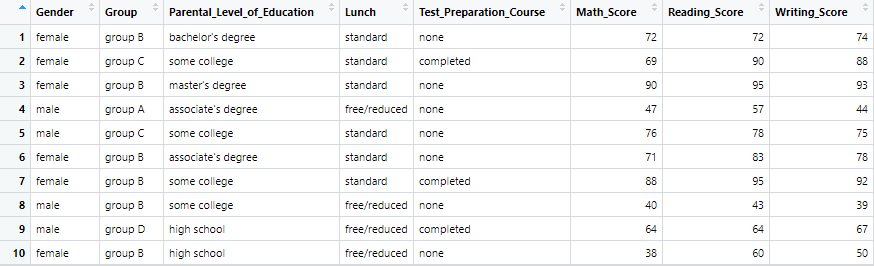

# Explore of Students Performance in Exams

Dataset: [Students Performance in Exams (Original)](https://github.com/sit-2021-int214/017-StudentPerf_inExam/blob/main/StudentsPerformance_Original.csv)

## Library and Dataset

```R
# Pre-requisite
install.packages("DescTools") # Descriptive statistics
install.packages("MASS")      # Functions and datasets
install.packages("dplyr")     # Data manipulation
install.packages("readr")     # A fast and friendly way to read rectangular data
install.packages("assertive") # Readable check functions to ensure code integrity
install.packages("stringr")   # Character manipulation

# Use libraries
library(DescTools)
library(MASS)
library(dplyr)
library(readr)
library(assertive)
library(stringr)

# Import dataset
StudentPerf <- read.csv("https://raw.githubusercontent.com/sit-2021-int214/017-StudentPerf_inExam/main/StudentsPerformance_Original.csv")
```

## Cleaning Dataset

```R
# Cleaning Dataset
StudentPerf <- StudentPerf %>% rename(Gender='gender')
StudentPerf <- StudentPerf %>% rename(Group='race.ethnicity')
StudentPerf <- StudentPerf %>% rename(Parental_Level_of_Education='parental.level.of.education')
StudentPerf <- StudentPerf %>% rename(Lunch='lunch')
StudentPerf <- StudentPerf %>% rename(Test_Preparation_Course='test.preparation.course')
StudentPerf <- StudentPerf %>% rename(Math_Score='math.score')
StudentPerf <- StudentPerf %>% rename(Reading_Score='reading.score')
StudentPerf <- StudentPerf %>% rename(Writing_Score='writing.score')
StudentPerf <- StudentPerf %>% arrange(Group) # Ascending order

# Create Cleaning Dataset
write_csv(StudentPerf, file = "StudentsPerformance_Clean.csv")
```

### ความหมายของชื่อคอลัมน์ที่ได้ทำการ Clean ชุดข้อมูลแล้ว

**Gender:** เพศ\
**Group:** กลุ่ม\
**Parental Level of Education:** ระดับการศึกษาผู้ปกครองของนักเรียน\
**Lunch:** ค่าอาหารกลางวันที่อิงจากรายได้ครอบครัว (Ref: [Discussion 194170](https://www.kaggle.com/spscientist/students-performance-in-exams/discussion/194170))\
**Test Preparation Course:** การเตรียมสอบก่อนสอบสนามจริง\
**Math Score:** คะแนนคณิตศาสตร์\
**Reading Score:** คะแนนการอ่าน\
**Writing Score:** คะแนนการเขียน

## Change to Tibble

```R
StudentPerf <- as_tibble(StudentPerf)
StudentPerf # or "as_tibble(StudentPerf)" to show result
```

ผลลัพธ์ที่ได้แปลงเป็น Tibble แล้ว

```R
# A tibble: 1,000 x 8
   Gender Group   Parental_Level_~ Lunch Test_Preparatio~ Math_Score Reading_Score Writing_Score
   <chr>  <chr>   <chr>            <chr> <chr>                 <int>         <int>         <int>
 1 male   group A associate's deg~ free~ none                     47            57            44
 2 male   group A some college     stan~ completed                78            72            70
 3 female group A master's degree  stan~ none                     50            53            58
 4 male   group A master's degree  free~ none                     73            74            72
 5 female group A associate's deg~ stan~ completed                55            65            62
 6 male   group A some high school free~ none                     39            39            34
 7 male   group A associate's deg~ free~ none                     62            61            55
 8 female group A associate's deg~ free~ none                     41            51            48
 9 male   group A bachelor's degr~ stan~ completed                80            78            81
10 male   group A some college     free~ completed                50            47            54
# ... with 990 more rows
```

## Result of Cleaned Dataset

ผลลัพธ์ที่ใช้คำสั่ง `View(StudentPerf)`



ผลลัพธ์ที่ใช้คำสั่ง `glimpse(StudentPerf)`

```R
Rows: 1,000
Columns: 8
$ Gender                      <chr> "male", "male", "female", "male", "female", "male", "male"~
$ Group                       <chr> "group A", "group A", "group A", "group A", "group A", "gr~
$ Parental_Level_of_Education <chr> "associate's degree", "some college", "master's degree", "~
$ Lunch                       <chr> "free/reduced", "standard", "standard", "free/reduced", "s~
$ Test_Preparation_Course     <chr> "none", "completed", "none", "none", "completed", "none", ~
$ Math_Score                  <int> 47, 78, 50, 73, 55, 39, 62, 41, 80, 50, 58, 54, 51, 57, 62~
$ Reading_Score               <int> 57, 72, 53, 74, 65, 39, 61, 51, 78, 47, 70, 53, 49, 43, 67~
$ Writing_Score               <int> 44, 70, 58, 72, 62, 34, 55, 48, 81, 54, 67, 47, 51, 47, 69~
```

-----------------------------------------------------------------------------------------------------------------------------------------

## Define Questions

### ข้อ 1

นักศึกษาเพศใดจบปริญญาตรีมากกว่ากัน

```R

```

ผลลัพธ์

```R

```

### ข้อ 2

คนที่ทำคะแนนการสอบทั้งคณิตศาสตร์ การอ่าน และการเขียนได้ 90 คะแนนขึ้นไปมีกี่คน

```R

```

ผลลัพธ์

```R

```

### ข้อ 3

เพศไหนทำคะแนนได้มากกว่ากัน

```R

```

ผลลัพธ์

```R

```

### ข้อ 4

คะแนนเฉลี่ยในแต่ละวิชาของชายหรือหญิงมีค่ามากน้อยต่างกันเพียงใด

```R

```

ผลลัพธ์

```R

```

### ข้อ 5

ค่าเฉลี่ยการทั้งสอบทั้งคณิตศาสตร์ การอ่าน และการเขียนมีค่าเท่าไร แล้วให้เปลี่ยนชื่อคอลัมน์ให้สื่อความหมาย เช่น `Subject_Score` เป็น `Subject_AVG` ที่จะใช้ summarise

```R
StudentPerf %>%
  select(Math_Score, Reading_Score, Writing_Score) %>%
  summarise(MATH_AVG = mean(Math_Score),
            READING_AVG = mean(Reading_Score),
            WRITING_AVG = mean(Writing_Score))
```

ผลลัพธ์

```R
# A tibble: 1 x 3
  MATH_AVG READING_AVG WRITING_AVG
     <dbl>       <dbl>       <dbl>
1     66.1        69.2        68.1
```

คะแนนเฉลี่ย Math: 66.1 คะแนน\
คะแนนเฉลี่ย Reading: 69.2 คะแนน\
คะแนนเฉลี่ย Writing: 68.1 คะแนน

### ข้อ 6

ให้หาคนที่ทำคะแนนได้สูงสุด (ได้เต็ม 100 คะแนน) โดยแสดงข้อมูลคอลัมน์ของ เพศ กลุ่ม ระดับการศึกษาของผู้ปกครอง และคะแนนที่ทำได้ทั้งคณิตศาสตร์ การอ่าน และการเขียน

```R
StudentPerf %>%
  select(Gender,
         Group,
         Parental_Level_of_Education,
         Math_Score,
         Reading_Score,
         Writing_Score) %>%
  filter(StudentPerf$Math_Score == max(StudentPerf$Math_Score) &
         StudentPerf$Reading_Score == max(StudentPerf$Reading_Score) &
         StudentPerf$Writing_Score == max(StudentPerf$Writing_Score))
```

ผลลัพธ์

```R
# A tibble: 3 x 6
  Gender Group   Parental_Level_of_Education Math_Score Reading_Score Writing_Score
  <chr>  <chr>   <chr>                            <int>         <int>         <int>
1 female group E bachelor's degree                  100           100           100
2 male   group E bachelor's degree                  100           100           100
3 female group E associate's degree                 100           100           100
```

1. เพศหญิง กลุ่ม E ระดับการศึกษาของผู้ปกครอง: ปริญญาตรี; ทำคะแนน Math, Reading และ Writing ได้ 100 คะแนนเต็ม
2. เพศชาย กลุ่ม E ระดับการศึกษาของผู้ปกครอง: ปริญญาตรี; ทำคะแนน Math, Reading และ Writing ได้ 100 คะแนนเต็ม
3. เพศหญิง กลุ่ม E ระดับการศึกษาของผู้ปกครอง: อนุปริญญา; ทำคะแนน Math, Reading และ Writing ได้ 100 คะแนนเต็ม
