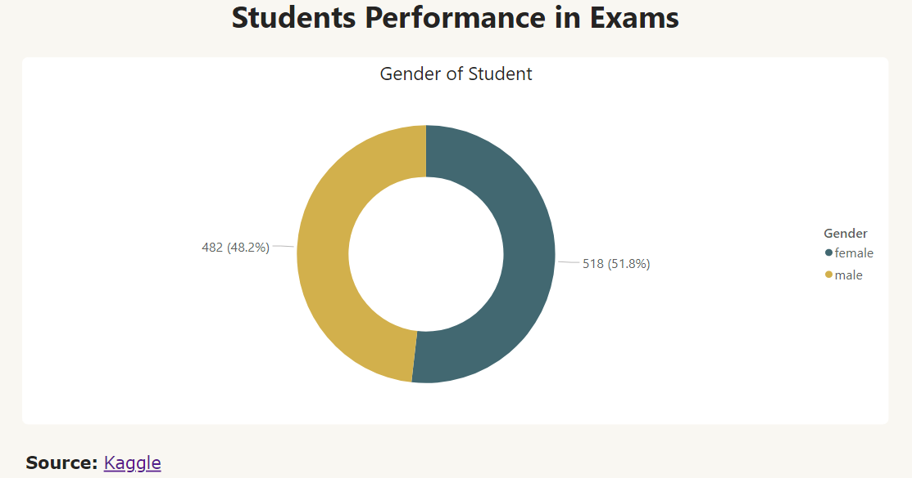
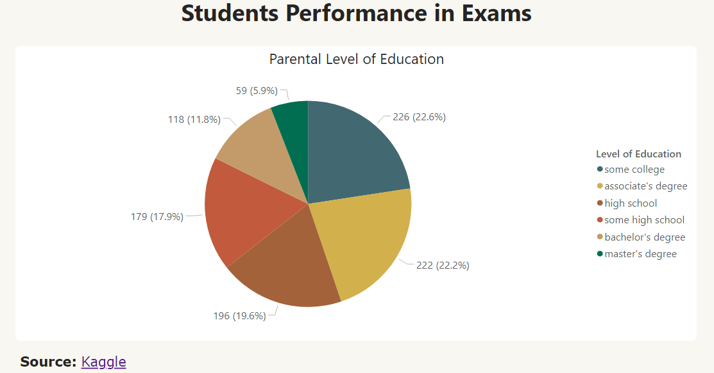
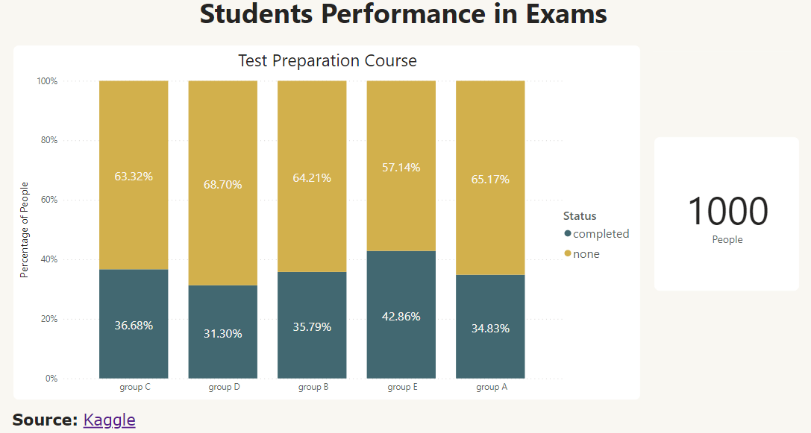
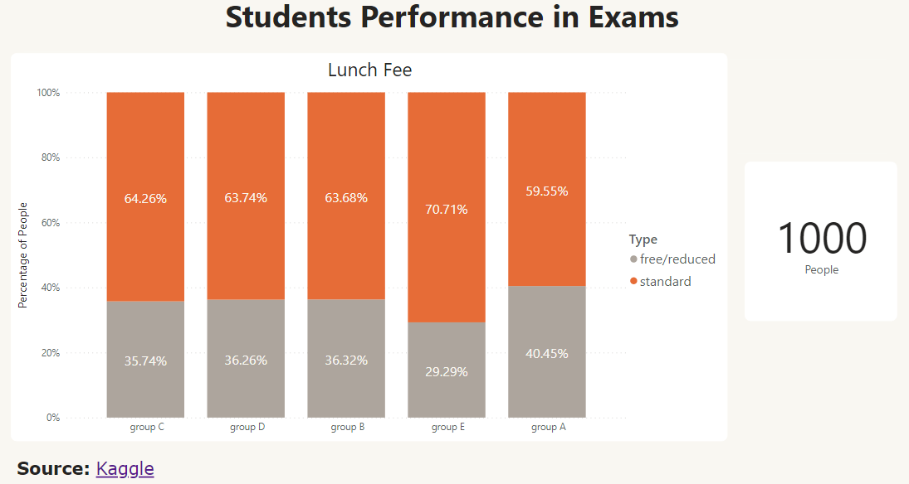
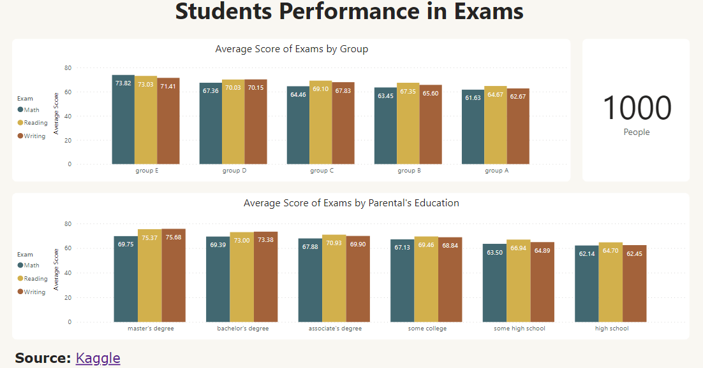
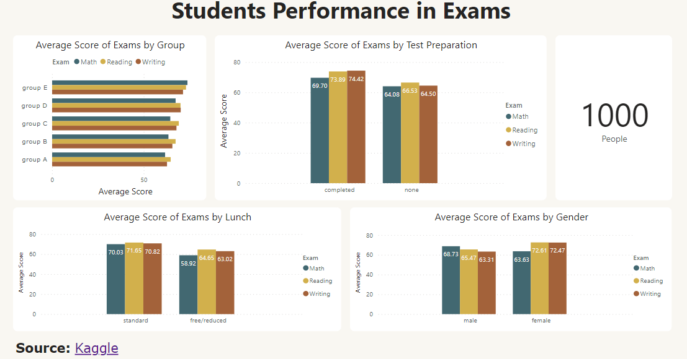

# Data Visualization with Power BI

Dashboard: [Power BI](https://app.powerbi.com/view?r=eyJrIjoiZDA5ZTg3OGItZDE1Ny00OWE3LWEyZmItMWMyZGM0ZGQ1YTllIiwidCI6IjZmNDQzMmRjLTIwZDItNDQxZC1iMWRiLWFjMzM4MGJhNjMzZCIsImMiOjEwfQ%3D%3D)

## Gender of Student

เพศของนักเรียนหรือนักศึกษา

## Parental Level of Education

ระดับการศึกษาของผู้ปกครองหรือครอบครัว

## Test Preparation Course

การเตรียมสอบ (pre-test) ก่อนไปสอบในสนามสอบจริง

## Lunch Fee

ค่าอาหารกลางวันของนักเรียนหรือนักศึกษา

## Average Score Summary 1

ค่าเฉลี่ยของคะแนนการสอบหมวดคณิตศาสตร์ การอ่าน และการเขียน โดยอิงจากกลุ่มและระดับการศึกษาของผู้ปกครอง

## Average Score Summary 2

ค่าเฉลี่ยของของคะแนนการสอบหมวดคณิตศาสตร์ การอ่าน และการเขียน โดยอิงจากการเตรียมสอบ ค่าใช้จ่ายอาหารกลางวัน และเพศ
