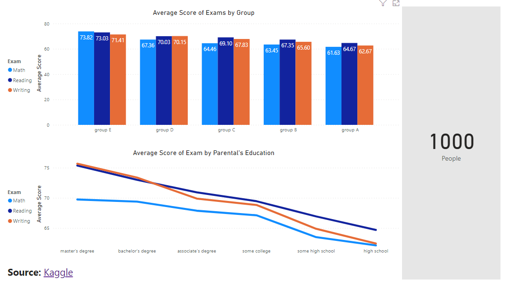
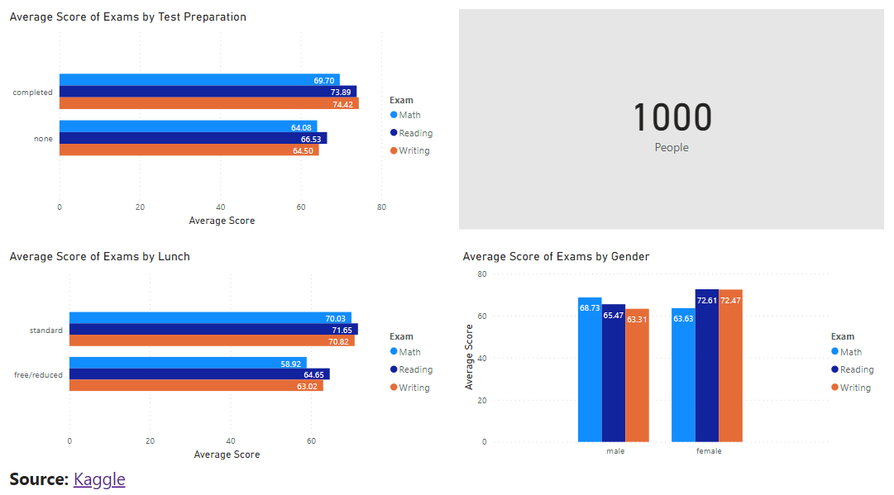

# Data Visualization with Power BI

Dashboard: [Power BI](https://app.powerbi.com/view?r=eyJrIjoiMzA2YTkyMTQtYzdiZC00YTQxLTljZDctNWVjOWIzZjJjNDBmIiwidCI6IjZmNDQzMmRjLTIwZDItNDQxZC1iMWRiLWFjMzM4MGJhNjMzZCIsImMiOjEwfQ%3D%3D&pageName=ReportSection477c156ed02a353a3bb8)

## Average Score Summary 1

ค่าเฉลี่ยของคะแนนการสอบหมวดคณิตศาสตร์ การอ่าน และการเขียน โดยอิงจากกลุ่มและระดับการศึกษาของผู้ปกครอง

## Average Score Summary 2

ค่าเฉลี่ยของของคะแนนการสอบหมวดคณิตศาสตร์ การอ่าน และการเขียน โดยอิงจากการเตรียมสอบ ค่าใช้จ่ายอาหารกลางวัน และเพศ
