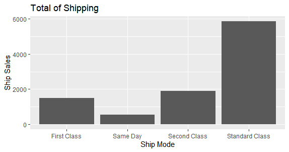
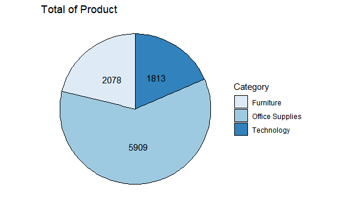

# R-Assignment 4

## About

**Created by:** นายชาญ ทองเจิม (ID: 63130500019)\
**Dataset:** Superstore Sales Dataset (Original from [Kaggle](https://www.kaggle.com/rohitsahoo/sales-forecasting))\
**Raw Dataset:** [safesit23/INT214-Statistics](https://raw.githubusercontent.com/safesit23/INT214-Statistics/main/datasets/superstore_sales.csv)

### Outlines

1. Explore the dataset
2. Learning function from `lubridate`
3. Transform data with `dplyr` and finding insight the data
4. Visualization with `ggplot2`

## Part 1: Explore the dataset

### Library and Dataset

```R
# Pre-requisites
install.packages("dplyr")     # Data manipulation such as mutate, select, filter, etc.
install.packages("readr")     # A fast and friendly way to read rectangular data
install.packages("ggplot2")   # Histogram, Density Plot, Scatter Plot, etc.
install.packages("lubridate") # Makes it easier to work with dates and times

# Use libraries
library(dplyr)
library(readr)
library(ggplot2)
library(lubridate)

# Import dataset
Superstore_Sales <- read.csv("https://raw.githubusercontent.com/safesit23/INT214-Statistics/main/datasets/superstore_sales.csv")

# Change to Tibble
Superstore_Sales <- as_tibble(Superstore_Sales)
```

### See dataset result

```R
# Print dataset and data types
glimpse(Superstore_Sales)

# Show dataset
View(Superstore_Sales)
```

### Print Dataset

ใช้คำสั่ง `glimpse(Superstore_Sales)` เพื่อแสดงผลลัพธ์ของชุดข้อมูลและชนิดข้อมูล

```R
Rows: 9,800
Columns: 18
$ Row.ID        <int> 1, 2, 3, 4, 5, 6, 7, 8, 9, 10, 11, 12, 13, 14, 15, 16, 17, 18, 19, 20, 2~
$ Order.ID      <chr> "CA-2017-152156", "CA-2017-152156", "CA-2017-138688", "US-2016-108966", ~
$ Order.Date    <chr> "08/11/2017", "08/11/2017", "12/06/2017", "11/10/2016", "11/10/2016", "0~
$ Ship.Date     <chr> "11/11/2017", "11/11/2017", "16/06/2017", "18/10/2016", "18/10/2016", "1~
$ Ship.Mode     <chr> "Second Class", "Second Class", "Second Class", "Standard Class", "Stand~
$ Customer.ID   <chr> "CG-12520", "CG-12520", "DV-13045", "SO-20335", "SO-20335", "BH-11710", ~
$ Customer.Name <chr> "Claire Gute", "Claire Gute", "Darrin Van Huff", "Sean O'Donnell", "Sean~
$ Segment       <chr> "Consumer", "Consumer", "Corporate", "Consumer", "Consumer", "Consumer",~
$ Country       <chr> "United States", "United States", "United States", "United States", "Uni~
$ City          <chr> "Henderson", "Henderson", "Los Angeles", "Fort Lauderdale", "Fort Lauder~
$ State         <chr> "Kentucky", "Kentucky", "California", "Florida", "Florida", "California"~
$ Postal.Code   <int> 42420, 42420, 90036, 33311, 33311, 90032, 90032, 90032, 90032, 90032, 90~
$ Region        <chr> "South", "South", "West", "South", "South", "West", "West", "West", "Wes~
$ Product.ID    <chr> "FUR-BO-10001798", "FUR-CH-10000454", "OFF-LA-10000240", "FUR-TA-1000057~
$ Category      <chr> "Furniture", "Furniture", "Office Supplies", "Furniture", "Office Suppli~
$ Sub.Category  <chr> "Bookcases", "Chairs", "Labels", "Tables", "Storage", "Furnishings", "Ar~
$ Product.Name  <chr> "Bush Somerset Collection Bookcase", "Hon Deluxe Fabric Upholstered Stac~
$ Sales         <dbl> 261.9600, 731.9400, 14.6200, 957.5775, 22.3680, 48.8600, 7.2800, 907.152~
```

## Part 2: Learning function from lubridate

ฟังก์ชัน `ymd(), mdy(), mdy()` จากแพ็คเกจ [lubridate](https://cran.r-project.org/web/packages/lubridate/vignettes/lubridate.html) ที่ใช้ในการแปลงการอ่านวันที่ที่แตกต่างกันตามแต่ละประเทศให้เป็น ***ปี/เดือน/วัน*** ให้เข้าง่ายขึ้น\
\
ตัวอย่างการแปลงการอ่านวันที่แบบอเมริกันที่เป็น ***เดือน/วัน/ปี*** หรือใช้ฟังก์ชัน `mdy()`

```R
Superstore_Sales %>%
  select(Order.Date) %>%
  summarise(YYYY_MM_DD = mdy(Superstore_Sales$Order.Date))
```

ผลลัพธ์

```R
# A tibble: 9,800 x 1
   YYYY_MM_DD
   <date>    
 1 2017-08-11
 2 2017-08-11
 3 2017-12-06
 4 2016-11-10
 5 2016-11-10
 6 2015-09-06
 7 2015-09-06
 8 2015-09-06
 9 2015-09-06
10 2015-09-06
# ... with 9,790 more rows
```

## Part 3: Transform data with dplyr and finding insight the data

### ข้อ 1

สินค้าแต่ละประเภทมีจำนวนชนิดสินค้ารวมกันเท่าไร

```R
Cat_Count <- Superstore_Sales %>%
  group_by(Category) %>%
  select(Category, Sub.Category) %>%
  count(Sub.Category)

Cat_Count %>%
  summarise(Category = Category,
            Product = Sub.Category,
            Total = n) # Show result
```

ผลลัพธ์

```R
# A tibble: 17 x 3
# Groups:   Category [3]
   Category        Product     Total
   <chr>           <chr>       <int>
 1 Furniture       Bookcases     226
 2 Furniture       Chairs        607
 3 Furniture       Furnishings   931
 4 Furniture       Tables        314
 5 Office Supplies Appliances    459
 6 Office Supplies Art           785
 7 Office Supplies Binders      1492
 8 Office Supplies Envelopes     248
 9 Office Supplies Fasteners     214
10 Office Supplies Labels        357
11 Office Supplies Paper        1338
12 Office Supplies Storage       832
13 Office Supplies Supplies      184
14 Technology      Accessories   756
15 Technology      Copiers        66
16 Technology      Machines      115
17 Technology      Phones        876
```

// สินค้าแต่ละประเภทจะมี Product รวมกันโดยอิงจากประเภทสินค้าตามจำนวนที่แสดงไว้

- ใช้คำสั่ง `group_by()` ในการจัดกลุ่มประเภท Category
- ใช้คำสั่ง `select()` เพื่อเลือกคอลัมน์ที่จะแสดงผลข้อมูล Category
- ใช้คำสั่ง `count()` ในการนับจำนวนของประเภท Category
- ใช้คำสั่ง `summarise()` เพื่อสรุปผลลัพธ์โดยมีการเปลี่ยนชื่อคอลัมน์เพื่อให้เข้าใจง่ายขึ้น

### ข้อ 2

สินค้าประเภท Technology มีสินค้าชนิดใดมากที่สุดโดยเรียงจากมากไปน้อย

```R
Tech_Most <- Superstore_Sales %>%
  group_by(Product = Sub.Category) %>%
  select(Category, Sub.Category) %>%
  filter(Category == "Technology") %>%
  count(Category)

Tech_Most %>%
  summarise(Product = Product,
            Category = Category,
            Total = n) %>%
  arrange(desc(Total)) # Show result
```

ผลลัพธ์

```R
# A tibble: 4 x 3
  Product     Category   Total
  <chr>       <chr>      <int>
1 Phones      Technology   876
2 Accessories Technology   756
3 Machines    Technology   115
4 Copiers     Technology    66
```

// สินค้าประเภท Technology มีจำนวนสินค้าชนิด Phones มากที่สุด 876 ชิ้น

- ใช้คำสั่ง `group_by()` ในการจัดกลุ่มประเภท Sub Category
- ใช้คำสั่ง `select()` เพื่อเลือกคอลัมน์ที่จะแสดงผลข้อมูล Sub Category
- ใช้คำสั่ง `filter()` เพื่อกำหนดเงื่อนไขของ Category เป็น Technology
- ใช้คำสั่ง `count()` ในการนับจำนวนของประเภท Sub Category
- ใช้คำสั่ง `arrange()` ในการเรียงจากจำนวนตัวเลขโดยคำสั่ง `desc()` จะเรียงจากมากไปน้อย

### ข้อ 3

สินค้าประเภทใดขายดีที่สุดในเดือนกันยายน ปี 2016 โดยเรียงจำนวนสินค้าจากมากไปน้อย

```R
year <- year(mdy(Superstore_Sales$Order.Date))
month <- month(mdy(Superstore_Sales$Order.Date))

Most_2016 <- Superstore_Sales %>%
  filter(year == 2016,
         month == 9) %>%
  group_by(Product = Sub.Category) %>%
  select(Category, Sub.Category) %>%
  count(Category)

Most_2016 %>%
  summarise(Product = Product,
            Category = Category,
            Total = n) %>%
  arrange(desc(Total)) # Show result
```

ผลลัพธ์

```R
# A tibble: 15 x 3
   Product     Category        Total
   <chr>       <chr>           <int>
 1 Binders     Office Supplies    13
 2 Paper       Office Supplies    10
 3 Accessories Technology          8
 4 Phones      Technology          7
 5 Storage     Office Supplies     7
 6 Furnishings Furniture           6
 7 Appliances  Office Supplies     5
 8 Art         Office Supplies     5
 9 Labels      Office Supplies     4
10 Tables      Furniture           4
11 Envelopes   Office Supplies     3
12 Fasteners   Office Supplies     3
13 Chairs      Furniture           2
14 Machines    Technology          2
15 Bookcases   Furniture           1
```

// สินค้าประเภท Office Supplies มีจำนวนสินค้าที่ขายดีที่สุด 13 ชิ้น ในเดือนกันยายน ปี 2016

- สร้างตัวแปร year เพื่อแปลงให้เป็นตัวเลขของปีอย่างเดียว
- ใช้คำสั่ง `filter()` เพื่อกำหนดเงื่อนไขของ year เป็น 2016
- ใช้คำสั่ง `group_by()` ในการจัดกลุ่มประเภท Category
- ใช้คำสั่ง `count()` ในการนับจำนวนของประเภท Category
- ใช้คำสั่ง `summarise()` เพื่อสรุปผลลัพธ์โดยมีการเปลี่ยนชื่อคอลัมน์เพื่อให้เข้าใจง่ายขึ้น
- ใช้คำสั่ง `arrange()` ในการเรียงจากจำนวนตัวเลขโดยคำสั่ง `desc()` จะเรียงจากมากไปน้อย

### ข้อ 4

สินค้าประเภท Furniture ผลิตภัณฑ์ใดมีจำนวนสินค้ามากที่สุดและมี

```R
Total_Fur <- Superstore_Sales %>%
  group_by(Category) %>%
  select(Product.Name) %>%
  filter(Category == "Furniture") %>%
  count(Product = max(Product.Name))

Total_Fur %>%
  summarise(Category = Category,
            Product = Product,
            Total = n) # Show result
```

ผลลัพธ์

```R
# A tibble: 1 x 3
  Category  Product                                               Total
  <chr>     <chr>                                                 <int>
1 Furniture Westinghouse Mesh Shade Clip-On Gooseneck Lamp, Black  2078
```

// สินค้าประเภท Furniture ผลิตภัณฑ์ Westinghouse Mesh Shade Clip-On Gooseneck มีจำนวนสินค้ามากที่สุด 2078 ชิ้น

- ใช้คำสั่ง `group_by()` ในการจัดกลุ่มประเภท Category
- ใช้คำสั่ง `select()` เพื่อเลือกคอลัมน์ที่จะแสดงผลข้อมูล Product Name
- ใช้คำสั่ง `filter()` เพื่อกำหนดเงื่อนไขของ Category เป็น Furniture
- ใช้คำสั่ง `count()` ในการนับจำนวนของ Product Name โดยนับจำนวนค่าสูงสุดของมันที่มี
- ใช้คำสั่ง `summarise()` เพื่อสรุปผลลัพธ์โดยมีการเปลี่ยนชื่อคอลัมน์เพื่อให้เข้าใจง่ายขึ้น

### ข้อ 5

องค์กรเลือกการจัดส่งสินค้าแบบใดมากที่สุดในปี 2017

```R
year <- year(mdy(Superstore_Sales$Order.Date))

Corporate_Ship2017 <- Superstore_Sales %>%
  group_by(Ship.Mode) %>%
  filter(Segment == "Corporate" &&
            year == 2017) %>%
  count(Ship.Mode) %>%
  arrange(desc(n))

summarise(Corporate_Ship2017, Total = n) # Show result
```

ผลลัพธ์

```R
# A tibble: 2 x 2
  Ship.Mode   Total
  <chr>       <int>
1 First Class  1501
2 Same Day      538
```

// องค์กรเลือกการจัดส่งสินค้าแบบ First Class มากที่สุดในปี 2017

- ใช้คำสั่ง `group_by()` ในการจัดกลุ่มประเภท Ship Mode
- ใช้คำสั่ง `select()` เพื่อเลือกคอลัมน์ที่จะแสดงผลข้อมูล Product Name
- ใช้คำสั่ง `filter()` เพื่อกำหนดเงื่อนไขของ Segment เป็น Corporate และ year เป็น 2017
- ใช้คำสั่ง `count()` ในการนับจำนวนของ Ship Mode
- ใช้คำสั่ง `arrange()` ในการเรียงจากจำนวนตัวเลขโดยคำสั่ง `desc()` จะเรียงจากมากไปน้อย
- ใช้คำสั่ง `summarise()` เพื่อแสดงผลข้อมูลออกมาในแบบที่เรากำหนดไว้

### ข้อ 6

แสดงสินค้าที่ขายอยู่ใน New York City โดยให้แสดงเฉพาะ 10 รายการแรก

```R
NY_Product <- Superstore_Sales %>%
  group_by(City) %>%
  select(City, Product.Name) %>%
  filter(City == "New York City")

head(NY_Product, 10) # Show result
```

ผลลัพธ์

```R
# A tibble: 10 x 2
# Groups:   City [1]
   City          Product.Name                                                                   
   <chr>         <chr>                                                                          
 1 New York City Advantus Push Pins                                                             
 2 New York City AT&T CL83451 4-Handset Telephone                                               
 3 New York City Avery Binding System Hidden Tab Executive Style Index Sets                     
 4 New York City 9-3/4 Diameter Round Wall Clock                                                
 5 New York City Magnifier Swing Arm Lamp                                                       
 6 New York City Sanford Colorific Eraseable Coloring Pencils, 12 Count                         
 7 New York City Atlantic Metals Mobile 4-Shelf Bookcases, Custom Colors                        
 8 New York City I Need's 3d Hello Kitty Hybrid Silicone Case Cover for HTC One X 4g with 3d He~
 9 New York City Xerox 205                                                                      
10 New York City Atlantic Metals Mobile 3-Shelf Bookcases, Custom Colors
```

// ผลลัพธ์ของรายการสินค้าที่ขายอยู่ใน New York City ตามที่แสดงไว้

- ใช้คำสั่ง `group_by()` ในการจัดกลุ่มประเภท City
- ใช้คำสั่ง `select()` เพื่อเลือกคอลัมน์ที่จะแสดงผลข้อมูล City กับ Product Name
- ใช้คำสั่ง `filter()` เพื่อกำหนดเงื่อนไขของ City เป็น New York City
- ใช้คำสั่ง `head()` เพื่อแสดงผลข้อมูลออกมาตามที่เรากำหนดที่จะแสดงกี่รายการ

## Part 4: Visualization with ggplot2

### ข้อ 4.1

แสดงกราฟแท่งของประเภทการจัดส่งและจำนวนการจัดส่งของประเภทต่าง ๆ

```R
ShipMode_Plot <- Superstore_Sales %>% ggplot(aes(x=Ship.Mode)) + geom_bar()
ShipMode_Plot + ggtitle("Total of Shipping") + xlab("Ship Mode") + ylab("Ship Sales")
```

ผลลัพธ์



### ข้อ 4.2

กราฟจุดที่แสดงความสัมพันธ์ระหว่างประเภทสินค้าและชนิดสินค้า

```R
Category_Plot <- Superstore_Sales %>% ggplot(aes(x=Category, y=Sub.Category)) + geom_point()
Category_Plot + ggtitle("Category of Product") + xlab("Category") + ylab("Product Type")
```

ผลลัพธ์


